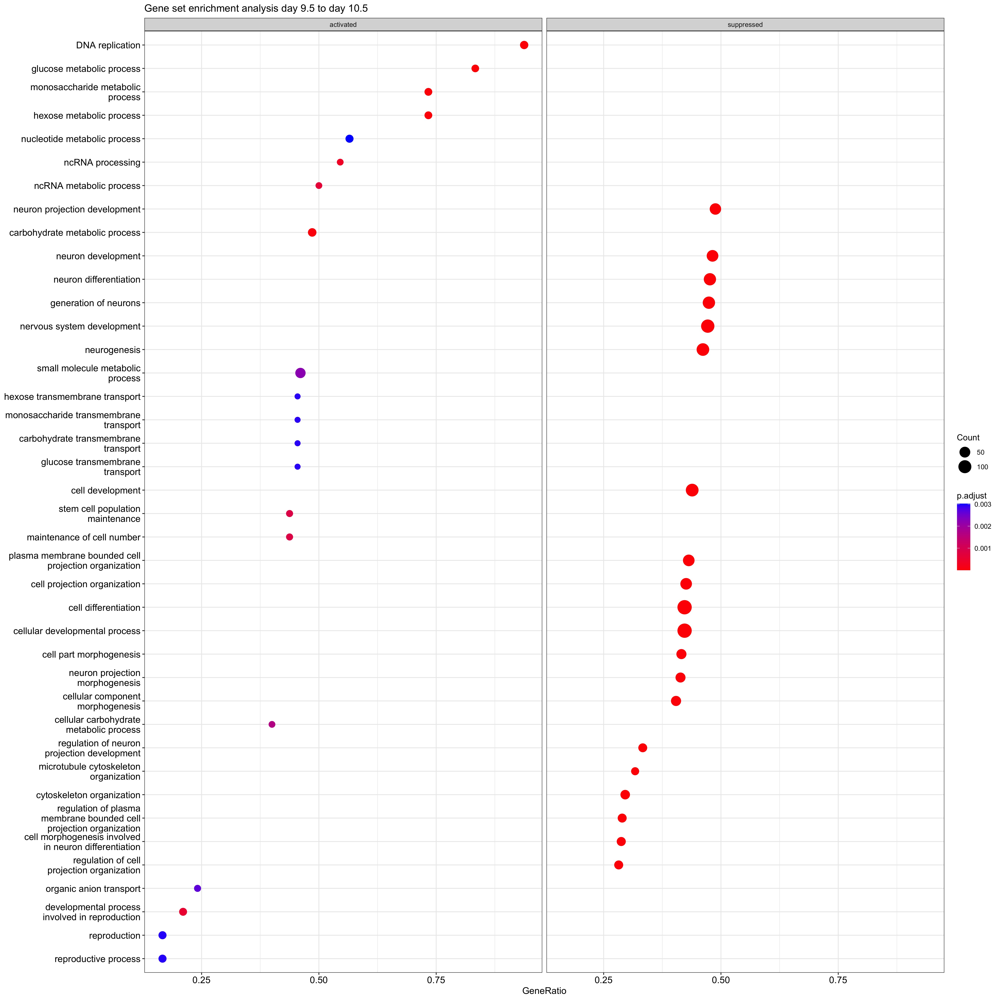
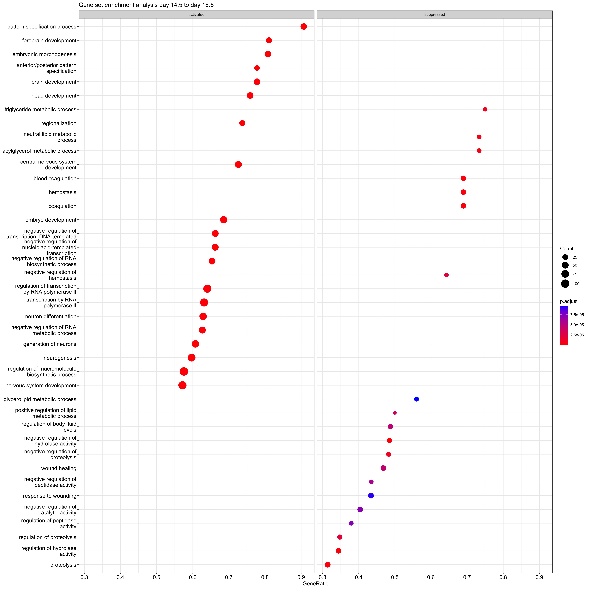

```{=tex}
\begin{center}
Final Report - Datascience MoBi 2022

Topic 04 - Team 02

Supervisor:   Dr. Maria Dinkelacker

Tutor:    Ian Fichtner

Institute of Pharmacy and Molecular Biotechnology

Heidelberg University 
\end{center}
```

------------------------------------------------------------------------

\newpage

# Abstract

Embryogenesis is difficult to study and therefore still not fully
understood. Yet, a novel approach borrowed from immune biology may
provide the necessary tools to embryo research in the scope of an
interdisciplinary application. Tissue restricted antigens are utilised
by the immune system for the production of t-cells to prevent
autoreactive events. Therefore, they are expressed simultaneously with
other genes in the corresponding tissue. Tissue specific antigens seem
to be a promising biological indicator to depict the intensity of gene
expression to a given time during tissue development. Such markers would
be a useful method to not only further analyse and understand
embryogenesis and organogenesis but inspect general tissue development
with high accuracy.

This project aims to explore embryogenesis in mice by analysing the
expression levels of tissue restricted antigens over time and
summarising these findings in an applicable dataframe.

\newpage

# 1 Introduction

The immune system is responsible for recognising and eliminating
threatening pathogens, such as bacteria, viruses or fungi, however,
distinguishing these from endogenous cells and not harming them. CD8+ T
cells (CD8s), also referred to as cytotoxic T cells precisely recognise
antigens via specific T cell receptors (TCRs). Thus, playing a vital
role in this process. In order to prevent an autoreactive
self-antigen-CD8 complex that would be harmful to the organism, T cells
undergo negative selection in addition to positive selection, in the
thymus. This negative selection process is mediated by medullary thymic
epithelial cells that are presented to developing T cells, leading to
the elimination of binding T cells (mTECs)[@Kyewski].

Auto-antigens fall in two categories: housekeeping antigens (HAs) and
tissue restricted antigens (TRAs). While HAs are expressed in a
multitude of tissues, TRAs are found to be expressed rather uniquely.
This results in HAs experiencing only insignificant amounts of
epigenetic inactivation. TRAs in contrast, display silencing extensively
in a majority of tissues. To classify as a TRA, an antigen is required
to exceed five times the median gene expression within one to four
tissue expression profiles [@dinkelacker2019]. An unpublished dataset by
Dr. Maria Dinkelacker will be utilised to analyse embryonic development.

Antigen expression levels constantly vary during embryogenesis, since
different stem cells undergo differentiation. This includes TRA
expression levels that display a temporal connection to the development
of specific organs. Due to this connection they offer an interesting
approach to study organ development. Despite spatiotemporally mapping of
organogenesis in mice recently, specific timing and expression levels of
TRAs remain underexplored. Hence, this project aims to investigate TRA
expression profiles within mice over a course of mid- to late
embryogenesis. Data by @irie2011comparative supported this undertaking.

In addition to the TRA analysis, the embryonic data will be examined
regarding chemokine expression levels. Chemokines, chemotactic
cytokines, are signalling molecules that do not only direct immune cells
to pathogenic locations, but also orchestrate cell migration during
developmental processes. Upon secretion, they promote cell survival,
proliferation, strengthening of immune responses and direction of
migrating cells. More than 40 chemokines are expected to operate within
vertebrates,each one with a grand influence over the immune system and
embryogenesis [@chemokine2002chemokine, @alanko2018chemokines]

This project aims to utilise the datasets on time-dependent embryonic
transcriptomes and TRAs to catalogue established TRAs in respect to
specific stages of embryonic development to offer a base of data that
may support further studies in tissue development.

# 2 Methods

## 2.1 Datasets

@irie2011comparative provided comparative data to study the
expression-levels of tissue-restricted antigens (TRAs) during embryonic
development. TRA data was isolated from the Microarray data with the
help of a TRA dataset [@dinkelacker2019]. The statistical open source
programming language R [@R], bioconductor packages, and an annotation
file [@cunningham2022ensembl] served to prepare data for the following
analysis.

**Embryonic data set GSE28389** There were two main criteria for
choosing a dataset. Firstly, it had to use Affymetrix microarray
analysis. Secondly it was required to display expression levels of the
whole mouse during different stages of embryogenesis. For the purpose of
this work the whole RNA of multiple wild type C57BL/6 mice embryos was
collected at eight different stages (Microarray chips: 3x E7.5, 3x E8.5,
3x E9.5, 3x E10.5, 2x E12.5, 2x E14.5, 2x E16.5, 2x E18.5). Triplicates
or Duplicates were homogenised before application on the Affymetrix
Mouse Genome 430 2.0 Array [@irie2011comparative].

**TRA dataset** Our TRA data stems from unpublished data by Dr. Maria
Dinkelacker. The data included in the "tra.2014.mouse.4301.5x.table.tsv"
table includes a larger quantity of TRAs and was thus chosen to work
with.

```{=tex}
\begin{table}[h] % hbpt!H are options for table placement
    \centering
    \caption{\textbf{Overview of datasets used for TRA analysis}}
    \label{tab:Thisisadummytable}
        \begin{tabular}{lcc}  % l(eft), r(ight), c(enter) are options for alignments of a column
            \toprule
            \textbf{dataset} & \textbf{datatype} & \textbf{source} \\
            \midrule
            embryonic dataset      & \makecell{Affymetrix Mouse Genome \\430 2.0 microarray}           & Irie and Kuratani, 2011            \\
            TRA dataset     & \makecell{specific dataframe for \\tissue specific genes and \\their main tissue}  &  \makecell{unpublished data from \\Dr. Maria Dinkelacker}     \\
        \end{tabular}
\end{table}
```
## 2.2 Packages

The essential Bioconductor packages for the analyses were "affy"
(version 1.74.0), "limma" (version 3.52.1) and "vsn" (version 3.64.0).
The package "affy" was applied for exploratory oligonucleotide array
analysis [@gautier2004irizarry]. Linear Models for Microarray and
RNA-Seq Data (limma) was used for differential expression analysis of
microarray data. The package uses voom method, linear modelling and
empirical Bayes moderation to assess differential expression and give
stable results even with a small number of arrays [@ritchie2015limma].
"Limma" can be utilised for all gene expression technologies including
microarray data. Variance stabilising normalisation via package "vsn"
was employed for data normalisation. VSN executes data calibration,
quantification of differential expression, and the quantification of
measurement error [@huber2002variance].

## 2.3 Quality control (QC) of the embryonic microarray data

Four major quality complications are commonly encountered when working
with microarray data. Low quality chips, imprints such as fingerprints
or marks from pipette tips, irregularities in dye distribution, and
light intensity extremes. To detect possible damages, we performed
single-chip control for all twenty chips. Conspicuous chips should be
removed at this point, however the number of biological replicates
contained in the data was quite scarce. Some development stages only
included data on two chips. Excluding an entire chip could thereby
affect the significance of further statistical work.

### 2.3.1 Single Chip Control

There are no visual damages such as fingerprints present on the chips.
Nevertheless the Affy chips of E12.5_1 and E14.5_1 are considerably
lighter in intensity. This is also observable in the boxplot before
normalisation.

{#id.class
width="40%"}
{width="40%"}

Figure 2.3.1: **Single chip control** Probe three of day E8.5 shows no
salience, whereas the first probe of day E12.5 is noticeably lighter in
intensity compared to other chips.

### 2.3.2 RNA Degradation

RNA Degradation plots serve as another possibility to detect physical
artefacts on the chips. It stands out that probe intensities are lower
towards the 5' end of a transcript than towards the 3' end which is
expected due to the nature of RNA degradation. Irregularities would
appear as individual lines that have slopes differing from the group
pattern. The RNA degradation plot overall shows a regular group pattern
without slopes that deviate significantly.

{width="40%"}

Figure 1.2: **RNA degradation plot** This plot is used to verify the
quality of RNA. Slopes with a higher steepness compared to the overall
pattern indicate low quality RNA.

### 2.3.3 Normalisation

The data had to be normalised before conducting further calculations
necessary to obtain differentially expressed genes (limma). Variance
stabilising normalisation (VSN) is specific for Affymetrix GeneChip
probe level data and thus a reasonable choice for this step. VSN does
probe-wise background correction and between-array normalisation. The
function returns an ExpressionSet that can be used for further
analysation. In the boxplot with VSN-normalised data it stands out that
the mean values of the different chips are similar and the intensity
differences equalised. Yet, it should be noted that even after
normalisation, there is still a slight increase visible in the means of
chip E12.5 and E14.5.

### 2.3.4 Scatter Plot

Furthermore, scatter plots can be used to review the quality of data. We
plotted the normalised chips against each other according to the
following pattern: E7.5_1 against E7.5_2,.., E8.5_3 against E 9.5_1,...
Plots comparing the same measurement points do not show scattering. Some
plots comparing different measurement points however display skewed
scattering.

### 2.3.5 MeanSdPlot

To verify the previous normalisation in regards to variance-mean
dependence a MeanSDPlot was used on the normalised data. A horizontal
line would indicate no dependence. In the plot below the line slightly
ascends with increasing mean value. However this is still in range, so
no data was excluded.

# 3 Results

## 3.1 Analysis of TRA gene expression

In order to determine expression levels of TRAs, the aforementioned data
was run through statistical devices and then visualised with different
methods. Within the framework of this project, the data was first
explored with k-means clustering, applying elbow method and silhouette
method to determine the optimal number of clusters. This was followed by
limma analysis with p values 0.001 and 0.005 on TRA and Chemokine data
and yielded respective tables. TRA and Chemokine expression were plotted
in different ways to visualise expression development in different
tissues. Some significant plots will be shown here, whereas consecutive
data can be found in supplementary material.

### 3.1.1 Dimensionality Reduction and Clustering (PCA, UMAP, t-SNE)

Dimensionality reduction, including Principal Component Analysis (PCA)
served as additional quality control and was followed by t-distributed
stochastic neighbour embedding (t-SNE) and uniform manifold
approximation and projection (UMAP) to further reduce dimensionality.

{width="25%"}
{width="25%"}
{width="25%"}
{width="25%"} Figure
3.1.1: **Reduction of dimensions and indirect Quality Control.** The 20
chips are shown as data points that contain gene expression as features,
respectively as loadings for the principle components (PCs). The first
14 PCs add up to 95% of cumulative proportion. Hence the remaining 6
were removed before further dimensionality reduction. t-SNE and UMAP
further reduce the 14 dimensions given by PCA to 2 dimensions with
maximal maintenance of information and clusters.

The PCA plots give clusters pairing data points of the same day along
the axis of individual PCs. The orientation of coherent data points
allows to foreclose batch errors rendering the chosen dataset as
reliable. UMAP, with nearest neighbours 5 results in data with an ideal
number of two clusters. One of which contains probes from days E7.5 to
E10.5 and the other from E12.5 to E18.5. t-SNE, with perplexity 4, shows
three clusters (optimal number of clusters was determined via Silhouette
method). Again, separating chips with early and late embryonic data.

### 3.1.2 Differentially Expressed Gene Analysis (DEGA)

In an effort to determine the expression profile of TRAs over the course
of mouse embryogenesis, every cons was plotted against the next (E7.5
against E8.5, E8.5 against E 9.5) during Differential Expressed Gene
Analysis (DEGA).

{width="36%"}
{width="35%"}
{width="35%"}
{width="36%"}

Figure 3.1.2: **Difference in TRA expression over the course of mid- to
late embryogenesis.** Here shown are the quantities of differentially
expressed genes in different organs from one time point to the next.
Tissues are enlisted on the y-axis, while the x-axis provides scaling
for an absolute count of differentially expressed TRA genes.

These bar plots show prominent TRA expression in testicles, liver,
dorsal root ganglia and amygdala. Testicles account for the highest
amount of differentially expressed TRA genes in a majority of phases,
highlighted by the abundance of diferentially expressed genes (DEGs) at
phase E12.5 to E14.5, E14.5 and E16.5 being an exception within this
profile. Liver-specific TRA expression especially stands out during
development of E14.5 to E16.5, while dorsal root ganglia associated
genes peak during developmental phases of E8.5 to E9.5 to E10.5 to
E12.5; mid-embryogenesis and late embryogenesis. Comparatively,
amygdala-related TRAs display significant levels during E9.5 to E10.5 to
E12.5, but do not stand out as intensely as testicles, liver and dorsal
root ganglia. It is noticeable that in the interval of E7.5 to E8.5 and
E12.5 to E14.5 gene expression seems more differentiated, with
testicle-associated genes skyrocketing.

### 3.1.3 Volcano plots

In an effort to determine TRAs with significant gene regulation, DEG
analysis was visualised in volcano plots.

{width="40%"}
{width="40%"}

Figure 3.1.3: **Differentially expressed TRAs labelled at maximum
divergence and significance.** Differentially expressed genes are
plotted according to the intensity (x-axis) and significance (y-axis) of
their up or down regulation. On the left from E7.5 to E8.5 and on the
right from E16.5 to E18.5.

Results of the volcano plot provide a collection of significantly up or
down regulated genes being upregulated in tissues of liver, umbilical
cord and testis during E7.5 to E8.5 and in tissues of the umbilical
cord, epidermis and liver as well during E16.5 to E18.5. It is
noticeable that the plots from days E12.5 to E14.5, E14.5 to 16.5, and
E16.5 to E18.5 have a left skewed distribution indicating more
significantly down regulated genes. The plot from day E8.5 to E9.5
generally shows lower p-values and thus greater significance.

### 3.1.5 Venn diagram

Venn diagrams quantify the overlap of TRA expression levels at different
embryonic stages.

{width="50%"}
{width="50%"}
Figure 3.1.5: **Venn Diagram of upregulated TRAs and downregulated
TRAs.** Upregulated (right side) and downregulated (left side) genes
from the different stages are plotted against each other. The key on the
right indicates an absolute TRA count. Intersections visualise an
overlap of TRA expression profiles at the given time.

Mid-embryonic phase E7.5 to E8.5 (517) as well the late embryonic phase
E16.5 to E18.5 (586) stand out in independent downregulation. Phases
E16.5 to 18.5 also show a pronounced count of upregulated differentially
expressed genes (833). However, it can also be noted that between E10.5
and E12.5 DEGs are both significantly up and down regulated
independently. Phase E16.5 to E18.5 exhibits the highest count of
upregulated as well as downregulated TRAs. There are no differentially
expressed genes that are up- or downregulated during all development
stages.

### 3.1.6 Gene Set Enrichment Analysis (GSEA)

In order to retrieve a functional profile of every gene set, gene set
enrichment analysis (GSEA) was performed for each day of measurement and
visualised.

{width="40%"}
{width="40%"}

Figure 3.1.6: **Gene functions in the course of mouse embryogenesis.**
Activated and suppressed DEGs and their functions are shown including
absolute count and p-value.

GSEA shows an inversion of gene function profiles between
mid-embryogenesis and late embryogenesis. Especially a shift in
metabolism-related genes from activation to suppression. Organ
development-related genes, however, are activated with time. Especially
neuron and nervous system related processes stand out.

### 3.1.7 Overview of TRA expression throughout embryogenesis

In order to research time-dependent expression levels of some
tissue-specific genes, we picked 5 genes that displayed the biggest
absolute difference between following days and had a p-value less than
0.01. The following dot plot aims to present distinct TRA genes, with
regard to days of embryogenesis. Gene *Lin28a* was amongst top 5
differentially expressed genes from day 9 to 10 as well as from 10 to
12, *Serpina6* - from 10 to 12 and from 16 to 18, *Hbb-y* - from 7 to 8
and from 16 to 18.

{width="91%"}

Each subplot illustrates one or more peaks in expression of a TRA gene,
within which it is noticeable that late embryogenesis accumulates a
higher expression of a certain gene in contrast to mid-embryogenesis and
vice versa. A considerable amount of highly expressed TRA genes are
associated with umbilical cord, especially with a tendency of peaks
towards late embryogenesis and a pronounced peak of Hba-x and Hbb-y.
Further tissues that are frequently represented are liver and dorsal
root ganglia.

This plot underlines the main goal of the project. It was possible to
generate an applicable dataframe and observe TRA expression
characteristics through several different plots.

## 3.2 Analysis of chemokine expression

Following the analysis of TRA expression levels, PCA and differential
expression analysis were also performed on chemokine and chemokine
receptor genes that were isolated from the studied gene expression set.
Annotated tables of differentially expressed genes with p-value less
than 0.05 and 0.01 for each consecutive daily comparison are provided in
supplementary data. In order to analyse change of chemokine expression
through day 7 to 18 we picked 5 genes with the greatest absolute
difference between following days and had a p-value less than 0.01.


In order to analyse the amount of up- and downregulated chemokines, two
venn diagrams were generated. In this diagram days of embryonic
development are compared with each other, resulting in intersections
that visualise an overlap of chemokine expression profiles. The major
upregulation occured between E16.5 and E18.5. The major downregulation
of chemokine-related genes was from E7.5 to E8.5 as well as from E16.5
to E18.5.

# 4 Discussion

This project aimed to generate a data frame containing TRA expression
levels connected to organogenesis in the time of mid- to late embryonic
mice development. In @chen2022spatiotemporal's similar work, the
location of expression was additionally taken into account. This
resulted in a spatiotemporal map of transcriptomes at different stages
of embryogenesis. The research of @chen2022spatiotemporal thereby helps
to validate certain results within this project.

### 4.1 Differential Expressed Gene Analysis (DEGA)

We analysed TRA expression levels to achieve a better understanding of
embryogenesis and organogenesis. An applicable dataframe was built and
multiple ways of analysing the data were applied. By plotting
differentially expressed genes over time it was possible to receive an
estimate on the amount of different tissue types developing during
different stages of embryogenesis. The expression activity, translated
into bar length, can be assumed to be proportional to organ development.
This enables further understanding of organogenesis in mice. Reflecting
on the observed results, three tissue types especially stand out during
mid- to late embryogenesis: testicles, the liver, and brain-associated
tissues. Based on this observation we can assume that brain-related
tissue is actively generated in a slightly fluctuating, yet constant
manner during the whole course of embryogenesis, especially in areas of
the dorsal root ganglia. Other studies observed similar developmental
patterns in brain related gene expression [@hartl2008transcriptome].
They hypothesised on the basis of their results that this expression
rate is rather constant due to limited cellular resources like energy,
space and water. This would match the assumption that brain development
is shown as dominant in the plots. Due to its importance over the whole
course of embryonic development this organ is constantly in need of the
full capacity of cellular resources, with the exception of the
phylotypic period.

In a similar fashion, liver-associated TRA genes experience expression
levels comparable to those of dorsal root ganglia. And only exceed brain
gene activities during late embryogenesis.This may result from liver
development which starts with the liver bud formation at E9.5
[@keng2000homeobox]. Lastly, testicle-related TRAs stand out due to
their extreme amount of differentially expressed genes in contrast to
remaining tissues. According to [@dinkelacker2019] a potential reason
for such high expression levels could be the fact that they are an
immune deprived site as in the case of spermatogenesis. Another attempt
to explain the strong expression of testicular TRAs could be based on
their very nature. They inhabit a germline expression character, mainly
to perform spermatogenesis [@law2019developmental]. Similar
developmental patterns can be observed in the research work of
@chen2022spatiotemporal, in which brain and liver development stand out
during analysis. However, other important tissue developments during
DEGA might have been underestimated due to the sheer intensity of testis
and liver TRAs present. This may be a major limitation of this attempt.
Furthermore a constant scaling of the axis for all plots would have been
more beneficial for analysis in retrospect.

### 4.2 Volcano Plots

Data visualisation with volcano plots aided the isolation of prominent
TRA genes that were up- or downregulation with a relevant significance.
Genes associated with reproductive functions, such as the placenta
(Sfmbt2, Fmr1nb) and testicles (Tex19.1) stand out. Researching
potential pathways corresponding to the intense regulation of these
genes should be considered. Generally, visualising genes of high and low
regulation can be later used to extract TRAs that might have some
greater significance in embryonic development. Interestingly, plots from
days 12 to 14, 14 to 16, and 16 to 18 indicated down regulation of genes
with a left skewed distribution. At the same time, they displayed higher
significance than the upregulated genes. It could be promising to
further validate this trend of downregulated genes towards the end of
embryo development and explore the main genes that contribute to this
trend.

### 4.3 Dot Plots

Although some genes that are specific to the same tissue demonstrate
similar trends regarding expression levels (e.g. *Hbb-y* and *Hba-x*,
both specific to liver), others show different trends (e.g. *Agtr2*).
*Hbb-y* plays an important role in the primitive erythroid lineage, it
is expressed in primitive erythroid cells [@capellera2016defining], this
may be the reason why it is distinctively regulated over the course of
embryogenesis. However *Agtr2* which is coding for the Angiotensin II
type 2 receptor is specifically expressed in the vascular muscle cell
during late gestation [@akishita1999expression]. This might be the
reason why expression of this gene increases on days 12 to 18, probably
exceeding the time frame of the study that provided us with this gene
expression set. The plot of most differentially expressed chemokines
over the course of embryogenesis provided valuable insights into tissue
development. For example *Cxcl15*, also known as lungkine, that is
strongly up-regulated on day 18, is expressed through embryogenesis
specifically by lung bronchoepithelial cells [@rossi1999lungkine],
suggesting that this tissue is already formed on the 18th day of
embryogenesis.

### 4.4 Venn Diagram

Another method to monitor time-related TRA activity was the venn
diagram, highlighting up- and downregulation of an absolute count of TRA
genes. The plot empathises with the original hypothesis of the paper we
chose our embryonic dataset from: the hourglass theory. The hourglass
theory supports the idea of a high and divergent gene expression during
early embryogenesis and late embryogenesis and a low and more conversed
expression during mid-embryogenesis [@irie2011comparative]. As mentioned
before, the venn diagram generated in our project presents an hourglass
theory-supporting character with noticeable increase in up- and
downregulation of genes during the earliest and latest embryonic stage.
Nevertheless analysis by venn diagram did not provide any information on
specific TRAs that experienced regulation, nor on general tissue
development. Another issue with this plot arose from the exclusive
structure of intersections, which complicated the information within the
plot.

### 4.5 Gene Set Enrichment Analysis (GSEA)

GSEA enabled us to analyse molecular mechanisms, such as the intensity
of metabolic activities, molecular transport mechanisms, biosynthesis
and cell cycle activities. However, in contrast to
@chen2022spatiotemporal, as well as DEGA, brain development received
suppression of genes, which is contradictory to previous research. Hence
accuracy of GSEA should be handled with caution regarding this project.
Additionally, data that stood out was presented in absolute numbers,
instead of specific TRA gene names, leaving the same issue as the venn
diagram that was not able to provide neither information on specific TRA
genes nor on organ development as a whole.

### 4.6 Problems and Limitation

During this project we encountered the general problem of plot
incomparability. Most plots differ in what they observe: singular,
specific genes or holistic tissue development, time-dependent TRA
expression or general regulatory profiles with no regard to time. For
example GSEA plots do not display gene names, whereas the Volcano plot
does. Another example is that the Venn and Volcano plots generally
analyse at the gene regulation independent of time, while GSEA and DEG
show at the expression levels over time. But in the end, this project
was able to successfully create an applicable dataframe with an overview
of organogenesis in mice.

### 4.7 Methods

At each point during the statistical assessment of our data a multitude
of options were available, such as the following: To determine the
optimal number of clusters, elbow method, silhouette method, and gap
statistics were performed, serving reliable information for consecutive
steps. However, when clustering t-SNE results, the optimal number of
clusters was predicted to be three. After visualisation, assigning the
number k=2 would have been more reasonable. Generally, clustering the
t-SNE and UMAP plots according to the PCs would have yielded more
insightful information. Although performance of t-SNE is said to be
[@van2008visualizing] robust to changes in the perplexity, different
values (2, 3, 4) were tested. They gave similar biologica results.
However, according to the original paper, typical values should range
between 5 and 50. In this case that was not possible, due to a low
sample count. The highest possible perplexity value equaled 4. For UMAP
a count of nearest neighbours had to be given to indicate the local
connectivity of the data. The maximum number possible in this case
equaled 20, since this is the amount of samples, displayed as
datapoints[@mcinnes2018umap]. Thus UMAP was conducted with perplexities
5, 15, and 20 to cover the possible cases of having close clusters in
the high dimensional dataset as well as more global ones. Clusters
within the UMAP plots were determined with k-means clustering, using the
elbow method as an indication for the optimal count. In contrast to the
t-SNE plots, there were more differences between respective plots and
the clustering was biologically less intuitive.

### 4.8 Perspectives

The combination of immunology and embryonic research may be a
breakthrough. Similar work on the basis of immune biology and tissue
related antigens may shape the future of embryonic research.
Additionally further exploration of TRAs can not only contribute to
research in embryonic development, but also play a considerable role in
cancer research and therapy.

\newpage

# 5 References
