```{r setup, include=FALSE}
knitr::opts_chunk$set(echo = TRUE)
```


# 1 Quality control

## 1.1 Single Chip Control
Supplementary examples of the Single Chip Control.

{#id.class width=33%}
{#id.class width=33%}
{#id.class width=33%}
{#id.class width=33%}
{#id.class width=33%}
{#id.class width=33%}

\newpage
## 1.2 Normalisation
Boxplots of the data from before and after normalisation.

{#id.class width=40%}
{#id.class width=40%}

## 1.3 Scatterplots
Two examples from within one day and from comparing two different days.

{#id.class width=40%}
{#id.class width=40%}

 
## 1.4 MeanSDplot
MeanSDplot of the normalised data.

{#id.class width=40%}


\newpage
# 2 Results

## 2.1 Dimensionality Reduction and Clustering
Further examples of PCA,T-SNE and UMAP of TRAs.


{#id.class width=33%}
{#id.class width=33%}
{#id.class width=33%}
{#id.class width=33%}
{#id.class width=33%}
{#id.class width=33%}
{#id.class width=33%}

## 2.2 Differential Expressed Gene Analysis
Difference in TRA expression over the course of mid- to late embryogenesis.

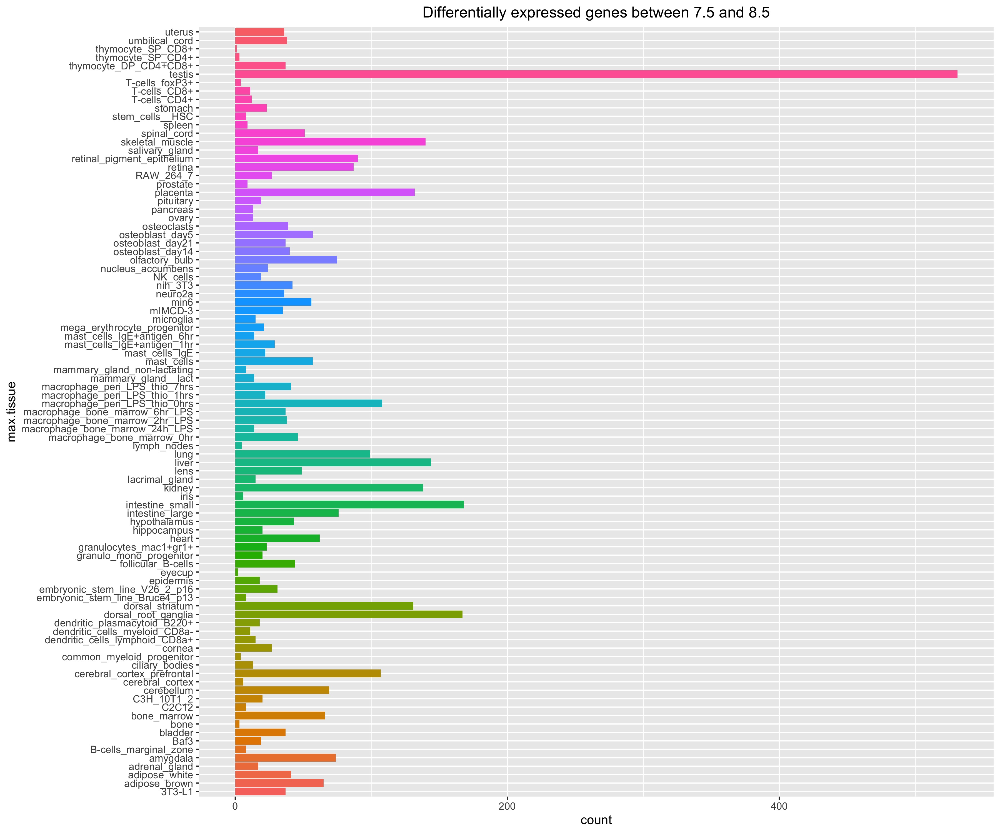{#id.class width=33%}
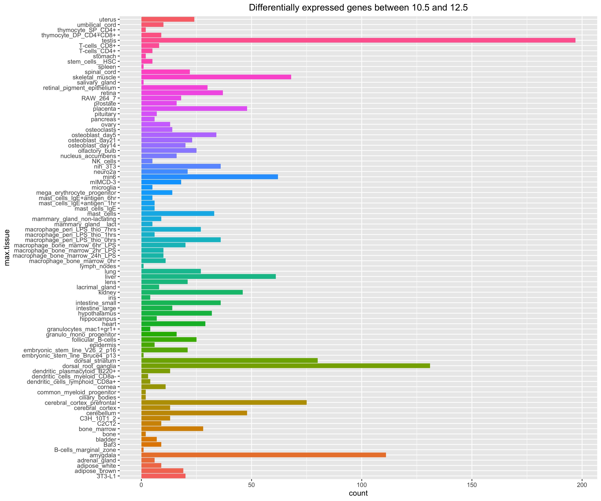{#id.class width=33%}
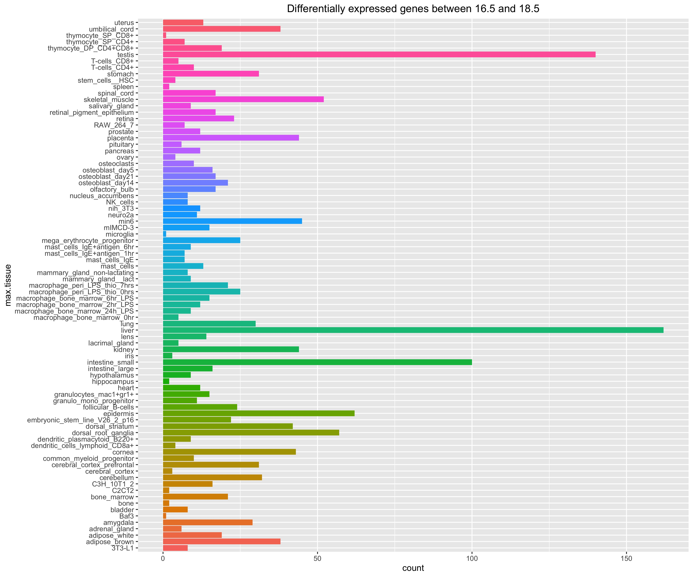{#id.class width=33%}

\newpage
## 2.3 Volcano plots
Supplementary volcano plots from different developmental stages.

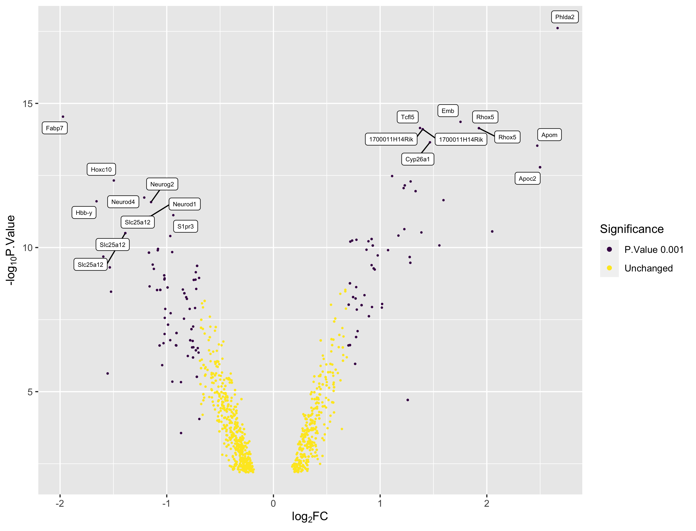{#id.class width=33%}
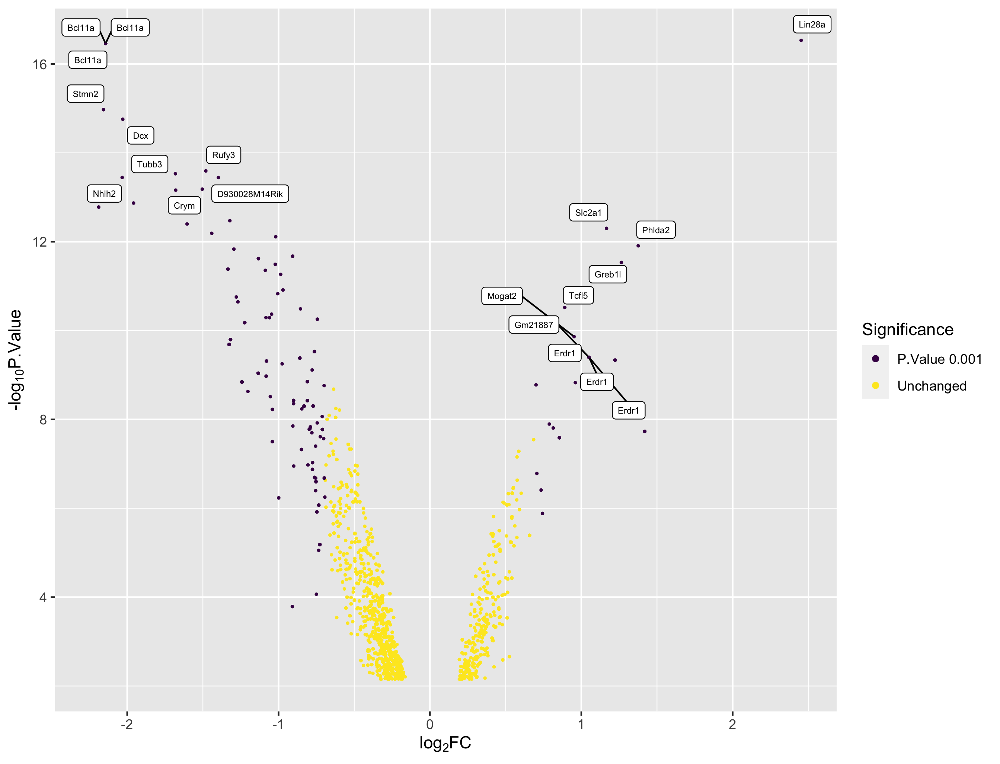{#id.class width=33%}
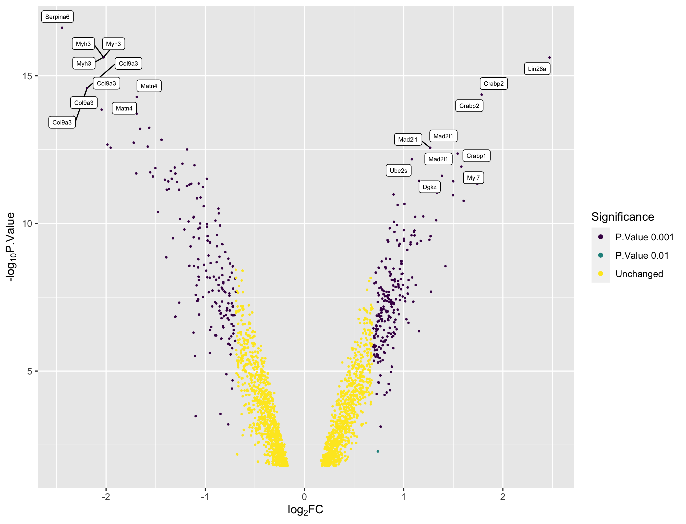{#id.class width=33%}
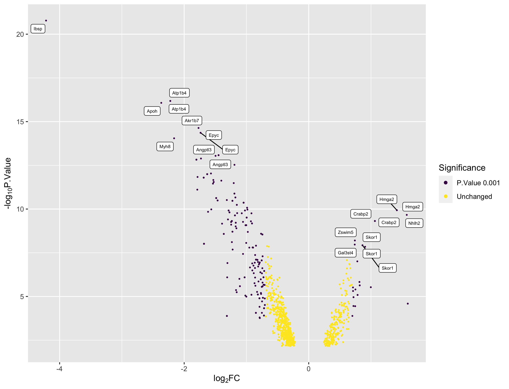{#id.class width=33%}
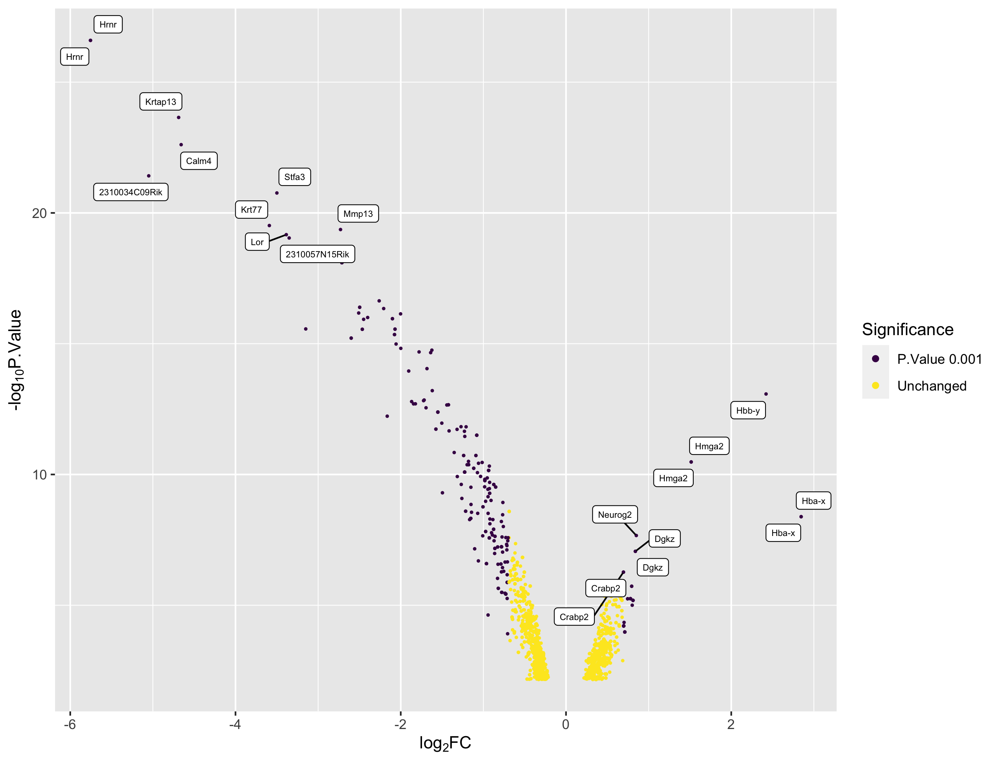{#id.class width=33%}


## 2.4 Gene Set Enrichment Analysis
Supplementary example plots for GSEA.

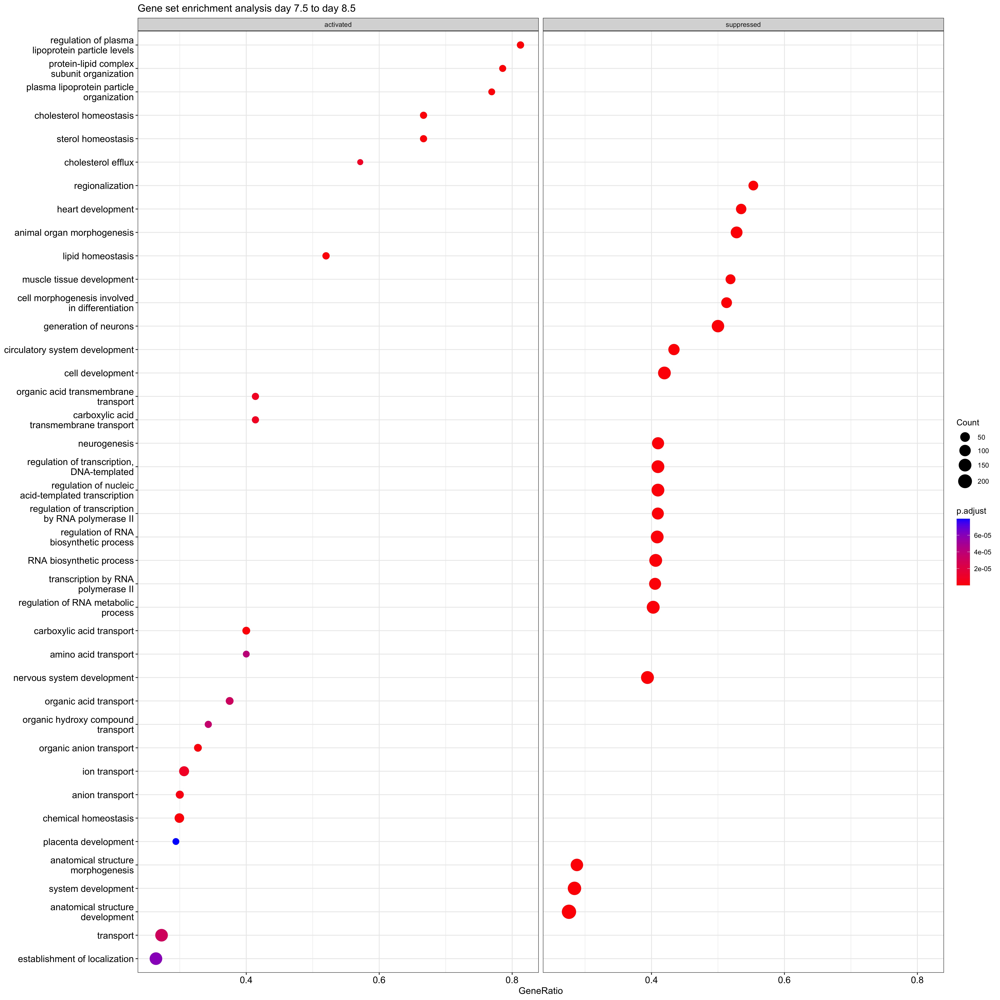{#id.class width=33%}
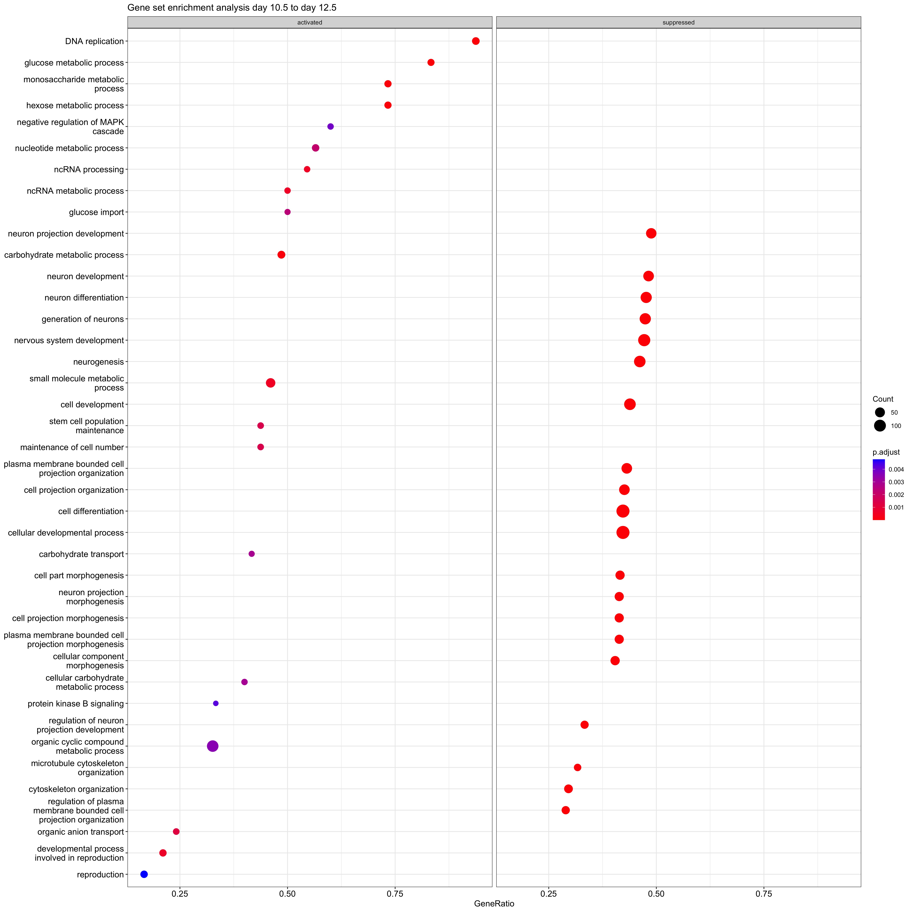{#id.class width=33%}
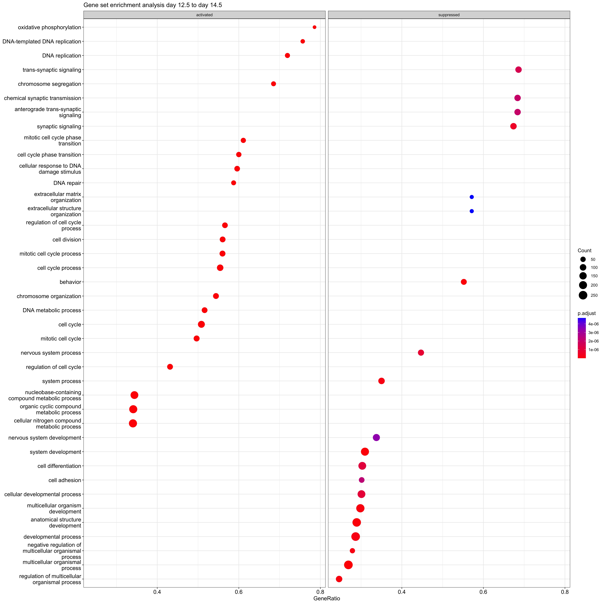{#id.class width=33%}

\newpage
## 2.5 Chemokine
PCA and venn diagrams

{#id.class width=50%}
{#id.class width=50%}
{#id.class width=50%}

{#id.class width=50%}
{#id.class width=50%}


